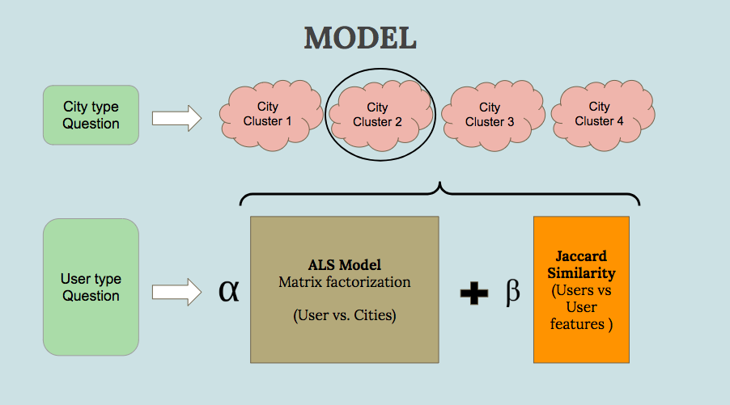

# Travel Time: Travel Destination Recommender
* Please switch to dev branch to run the model

In the main folder,
run:
  * 1) src/spark_model.py
  * 2) src/pickle_model.py
  * 3) webapp/server.py

# Overview/ Motivation
Traveling is always fun and relaxing. However, going to visit every single city in the world would be infeasible. How do we know which city will be a best match for us to travel to?
TraveTime is a travel desitination recommender that match the user's personality, age, and travel style to a user selected type of city. Whether, it's a solo trip in a dynamic environment or a fun family vacation, we will always find your best match!

# Recommender System
The Youtube recommendations videos on the left side of the screen, or the next suggested movie in your Netflix account. They are a product of recommender system based on user and item data.

Being able to personalized user's recommendations, recommender system is a powerful data science tool in any industry.

## Hybrid Model

### 1. ALS Collaborative Filtering Recommender
The PySpark's ALS model starts with a sparse utility matrix with items listed on the x axis and users listed on the y axis. The utility matrix will then break into two smaller U, V matrixes. These two small, dense matrixes (often with reduced rank) will then combined to reform a new, dense utility matrix with filled in predicted ratings.

###  2. Hybrid Recommender System
In order to improve the accuracy of the ALS model. I decided to add in another user-user jaccard similarity matrix. The jaccard similarity are calculated based on the number of common features between two users. A customized jaccard similarity function is created to return predicted ratings for all the cities based on user similarties.

The final predicted rating of my model is an addition of the alpha times the ALS model and the beta times the user-user jaccard similarity matrix.

### 3. Clustering
Besides accuracy, I also want to personalize the recommendation. Therefore, I used k-Means clustering on the vectorized TFIDF city reviews to create distinct city groups.

# Travel Class Model
Finally, a class model is generated to combine the clusters and the city rating predictions together. The model is represented by the diagram below.

# Data

Three Tripadvisor data sets from ResearchGate.
1) Users' Big 5 personality scores
2) Users' profiles (age, gender, travel style, Tripadvisor points, Tripadvisor traveler status, and etc.)
3) Users' city reviews and ratings

# Future work
* Hotel and restaurant reviews to be included to present a full set of travel plan recommendation package to users

* A travel quiz can be incorporated on the webapp to allow new travelers to input their personalities,  preferences and city ratings. This information can then be added to the dataset

* Divide up the user feature (2nd option bar) into multiple options bars

* Add picture to each city

# Tools
## Modeling/Machine Learning/Feature Engineering
* Scikit-learn
* Natural language processing
* TFIDF
* Numpy
* Pandas
## Data visualization:
* Matplotlib
* Seaborn
## Web App:
* Flask
* Bootstrap
* HTML
* CSS
* JavaScript
